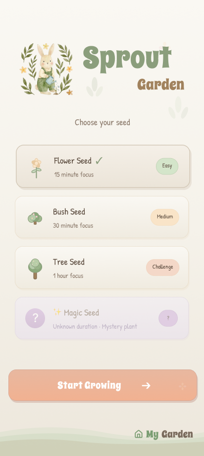
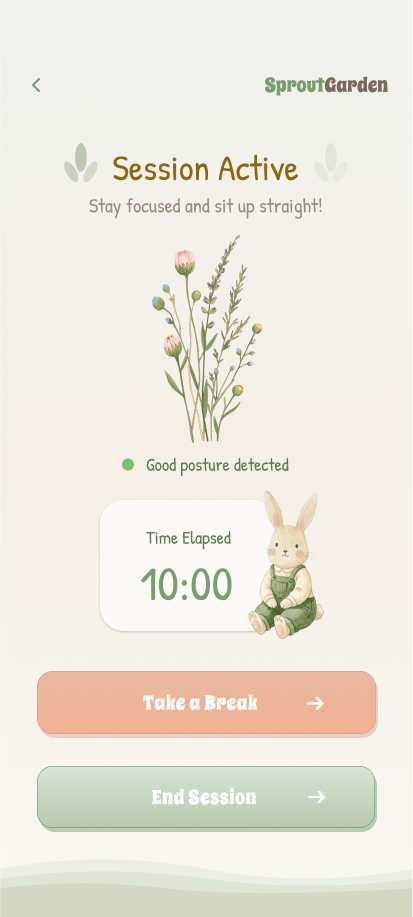
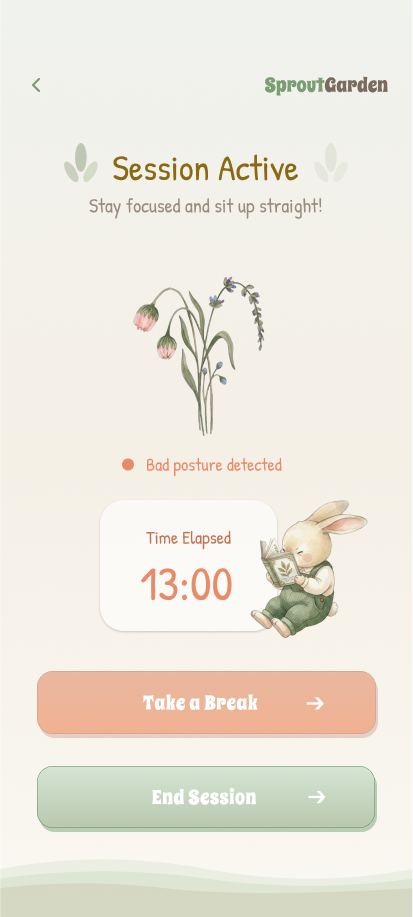
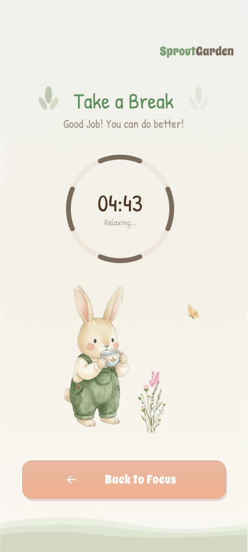
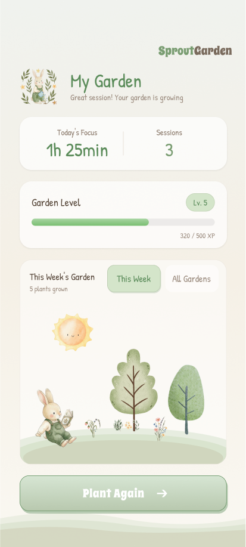

# 🌱 Sprout — A Calm Posture Companion for Growing Focus

> *"Don't interrupt. Visualize."*

**Platform:** ESP32-S2 Feather + CircuitPython 9.x

---

## Vision: Calm Computing

Most wearables demand attention. Sprout earns it.

In a world of buzzing alerts and flashing notifications, Sprout takes a different stance — one rooted in **Calm Computing**, the design philosophy that technology should inform without interrupting, and act at the periphery of human awareness rather than at its center.

Sprout is a chest-clip wearable for children and adolescents. It silently watches posture during a focus session and turns that data into something beautiful: a living constellation of colored bubbles that grow and drift on screen, shaped entirely by how the child sits.

There are no alarms. No vibrations. No sudden corrections.

| ❌ No Sound | ❌ No Vibration | ❌ No Sudden Alerts |
|:-----------:|:---------------:|:-------------------:|
| The child stays in flow | The body isn't startled | Attention isn't hijacked |

Instead of breaking focus to *fix* posture, Sprout creates a visual language for posture — one the child, parent, or educator can read at a glance, *after* the session.

---

## Who Is Sprout For?

Sprout is designed for **children aged 6–16** and the educators and caregivers who support them. It's particularly suited for:

- Children who struggle with sustained attention (ADHD-adjacent profiles)
- Classroom or tutoring environments where focus is structured in timed sessions
- Parents who want positive reinforcement tools, not surveillance
- Educators who want a non-disruptive, child-friendly biofeedback tool

The device is configured and started by an **educator or adult** (via button press), freeing the child to simply sit, focus, and grow their tree.

---

## The Interaction at a Glance

```
Wake (hand wave) → Select Duration → Calibrate Upright (5s) → Focus Session → Summary
```

### 1. Idle — Dark Screen
The screen is completely off. Sprout wakes only when a hand is waved near the proximity sensor (`APDS-9960`), drawing zero unnecessary attention.

### 2. Ready Screen
A friendly greeting appears: *"Hi Daisy, ready?"* Three duration options glow softly on the left edge. A subtitle blinks gently, inviting the educator to press a button.

```
10 min  ──  for younger children (habit formation)
20 min  ──  for elementary school age (6–10 yrs)
30 min  ──  for adolescents & adults (Pomodoro length)
```

These durations are grounded in developmental attention research, not arbitrary defaults.

### 3. Calibration — 5-Second Upright Baseline
Rather than assuming what "straight" looks like, Sprout *asks*. The child sits upright, the screen displays a tree icon and counts down from 5. During this window, the IMU averages hundreds of roll/pitch samples to create a **personalized postural zero**.

This is the key insight: posture is relative, not absolute. A child with scoliosis has a different "upright" than a child without. Sprout adapts.

### 4. Focus Session — The Living Visualization

The session runs silently. Every confirmed posture state generates a **bubble**:

| Posture | Color | Screen Region |
|---------|-------|---------------|
| Upright | 🟢 Green | Center |
| Leaning Forward | 🔴 Red | Top |
| Leaning Backward | ⚪ Gray | Bottom |
| Tilting Left | 🟠 Orange | Left |
| Tilting Right | 🟡 Yellow | Right |

Bubble **size** encodes duration — a 10-second upright hold creates a larger green bubble than a 2-second one. Bubbles drift, repel each other, and softly bounce off edges, driven by a 20Hz physics engine that also responds to the device's live tilt.

The effect: the screen becomes a living portrait of the session. A child who sat well sees a lush cluster of green bubbles at center. A child who frequently leaned forward sees red bubbles pooling at the top.

### 5. Summary Screen — Positive Reinforcement

After the session ends, bubbles dim to ~30% brightness and drift gently in the background. An encouraging message appears:

```
< 10% upright  →  "Next time, sit tall so the little tree grows."
10–30% upright →  "Not bad. Keep helping the tree grow."
> 30% upright  →  "Awesome! Your little tree is strong."
```

The screen stays active for **90 seconds**, then the device returns to sleep.

---

## Hardware

| Component | Role |
|-----------|------|
| ESP32-S2 Feather w/ Reverse TFT | Microcontroller + 240×135 display |
| ICM-20948 9-DoF IMU | Accelerometer for roll/pitch sensing |
| APDS-9960 | Proximity sensor for touchless wake |
| LiPo Battery + STEMMA-QT Cable | Portable power + I2C bus |

**Why a chest clip?**  
The sternum is the closest external landmark to the spine. Mounting there gives the accelerometer a gravity vector that directly reflects torso alignment — far more anatomically meaningful than a wrist or pendant, and far less noisy than a sensor that moves with hand gestures.

---

## Technical Architecture

### Posture Sensing Pipeline

**Step 1 — IMU → Roll & Pitch**

```python
roll  = math.degrees(math.atan2(ay, az))
pitch = math.degrees(math.atan2(-ax, math.sqrt(ay*ay + az*az)))
```

**Step 2 — Baseline Compensation**

```python
roll_offset  = roll  - roll_reference
pitch_offset = pitch - pitch_reference
```

**Step 3 — Posture Classification**

Left/Right thresholds are intentionally *more sensitive* than Forward/Backward — lateral slouching is subtler and easier to miss.

| State | Threshold |
|-------|-----------|
| UPRIGHT | `abs(offset) < 6°` |
| FORWARD | `roll < −9°` |
| BACKWARD | `roll > 9°` |
| LEFT | `pitch < −6°` |
| RIGHT | `pitch > 6°` |

**Step 4 — Temporal Filtering (3-second sustain)**

A posture must persist for **3 seconds** before it's confirmed. This prevents micro-movements — picking up a pencil, turning a page — from fragmenting the visualization with noise.

---

### Physics Engine (20Hz)

Each bubble is a lightweight dictionary storing `x, y, vx, vy, r, state`. Every physics tick applies three forces:

```
Spring Force    →  pulls bubble toward its state anchor
IMU Tilt Force  →  tilts the entire field with the user's body
Repulsion Force →  prevents overlap between bubbles
Boundary Bounce →  soft reflection off screen edges
Damping         →  vx *= 0.86 per frame (prevents endless oscillation)
```

**Embodied Tilt Mapping** — live IMU offsets produce subtle gravity drift across all bubbles. When the child leans left, the whole bubble field gently drifts left. This creates an intuitive, body-linked feedback loop without requiring the child to read any text.

```python
ax_tilt = pitch_offset * TILT_FORCE
ay_tilt = roll_offset  * TILT_FORCE
```

**Bubble Sizing**

```python
r = R_MIN + (hold_time / 10s) * (R_MAX - R_MIN)
r *= 0.6  # scaled down for visual density
```

---

### Dual-Frequency Loop

| Loop | Frequency | Purpose |
|------|-----------|---------|
| Sensor + State Machine | 5 Hz | IMU read, posture classification |
| Physics Engine | 20 Hz | Bubble motion, collision, tilt |

This separation keeps the display fluid while reducing I2C bus load and CPU overhead.

---

### System FSM

```python
while True:
    enter_ready()           # Proximity wake → show greeting
    minutes = wait_for_button()  # Educator selects duration
    calibrate_upright()     # 5s personalized baseline
    run_session(minutes)    # Sensing + physics + bubble generation
    show_summary()          # Visual summary + message
```

---

## UX Design Rationale

### Visual Metaphor: Growth, Not Grading
The tree / bubble / growth metaphor is deliberate. Children respond differently to gardening a plant than to receiving a score. Sprout frames posture as *nurturing* rather than *correcting* — a subtle but meaningful shift in emotional framing.

### No Text During Session
The session screen shows only the current posture label and elapsed time. The real information is in the bubbles. This respects the child's cognitive load — reading a dashboard during focus work is itself a distraction.

### Positive-Only Reinforcement
Even the lowest-performing message ("Next time, sit tall...") is forward-looking and encouraging, not shaming. The device never says "bad posture" or assigns a grade.

### Educator-First Configuration
The child never interacts with mode selection or calibration. The adult configures, the child focuses. This preserves the child's sense of autonomy during the session itself.

### Simulated Depth Without Alpha Transparency
The TFT display has no native alpha blending. For the summary screen, older bubbles are manually dimmed via RGB scaling:

```python
def dim_color(rgb, factor=0.35):
    r = int(((rgb >> 16) & 0xFF) * factor)
    g = int(((rgb >> 8)  & 0xFF) * factor)
    b = int((rgb & 0xFF) * factor)
    return (r << 16) | (g << 8) | b
```

This creates a perceived layering — active text in front, ghost bubbles behind — without any hardware support for transparency.

---

## File Structure

```
/
├── code.py                        # Main CircuitPython application
├── fonts/
│   └── Schoolbell-16-UIsubset.bdf # Custom handwritten-style UI font
├── images/
│   ├── sparkle.bmp                # Ready screen decoration
│   ├── seedling.bmp               # Ready screen decoration
│   └── tree.bmp                   # Calibration screen icon
└── lib/
    ├── adafruit_icm20x/           # IMU driver
    ├── adafruit_apds9960/         # Proximity sensor driver
    ├── adafruit_display_text/     # Text label rendering
    ├── adafruit_display_shapes/   # Circle primitive
    ├── adafruit_bitmap_font/      # BDF font loader
    ├── adafruit_imageload/        # BMP image loader
    └── adafruit_bus_device/       # I2C bus abstraction
```

---

## Key Engineering Challenges

**Memory Constraints**  
CircuitPython's heap is small. Bubbles are stored as plain dictionaries rather than class instances, minimizing object overhead. `math.sqrt()` is avoided in hot paths by comparing squared distances.

**IMU Drift**  
Long-term accelerometer drift is neutralized by the mandatory 5-second calibration at session start. There is no persistent zero — every session calibrates fresh to the user's current posture.

**Non-Blocking Timing**  
All timing is managed via `time.monotonic()` comparisons rather than `time.sleep()` in the main loop, allowing the physics engine and sensor state machine to interleave smoothly without blocking either thread.

---

## Software Interface Design

The software experience of **Sprout** is designed as a calm, garden-based interaction system that transforms posture and focus into visible growth. Instead of using warnings or rigid productivity cues, the interface gives students soft environmental feedback through plants, time, and progress.

The interface includes six key screens:
1. a **home screen** for selecting different “seeds” as study modes,
2. a **sensor detection screen** to verify posture before starting,
3. a **good-posture session screen** that rewards healthy study behavior,
4. a **break screen** with a recovery timer,
5. a **bad-posture session screen** that reflects posture issues through weakened plant states,
6. and a **garden dashboard** that summarizes long-term growth and study progress.

This system was intended to make studying feel:
- more nurturing than corrective,
- more embodied than screen-centered,
- and more motivating through gradual visual progress.

<table>
<tr>
<td align="center"></td>
<td align="center"></td>
<td align="center"></td>
<td align="center"></td>
<td align="center"></td>
<td align="center"></td>
</tr>
<tr>
<td align="center">Home</td>
<td align="center">Sensor</td>
<td align="center">Good Posture</td>
<td align="center">Bad Posture</td>
<td align="center">Break</td>
<td align="center">My Garden</td>
</tr>
</table>
---

## Future Directions

**Sensor Fusion**  
Integrate the ICM-20948's gyroscope to model 3D spinal curvature rather than raw tilt angle — a significantly richer signal for nuanced posture classification.

**WiFi Sync & Dashboard**  
Leverage the ESP32-S2's onboard WiFi to transmit session data to a parent or educator dashboard, enabling longitudinal tracking of focus and posture trends across weeks and months.

**Deep Sleep Power Management**  
Implement ESP32 deep-sleep between sessions to extend battery life from hours to days.

**Multi-User Shared Growth**  
Explore a networked mode where multiple Sprout devices share a single growing visualization — a collaborative garden where each child's focus contributes to a shared tree. Turns individual posture awareness into a social, cooperative experience.

---

## Acknowledgements

Built with ❤️ using [Adafruit CircuitPython](https://circuitpython.org/) libraries and the Adafruit ESP32-S2 Feather ecosystem.

Typography: [Schoolbell](https://fonts.google.com/specimen/Schoolbell) (Google Fonts) — chosen for its friendly, handwritten quality that feels approachable to children without sacrificing legibility on a small TFT display.
